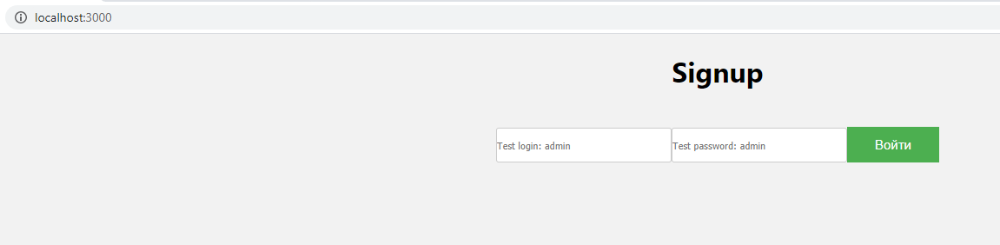

[SOFTSPIDERS](https://github.com/softspiders/softspiders)

# cra-login-formik-ts-starter
General development scheme [here](https://raw.githubusercontent.com/Jepria/doc/master/jfront/images/jfront-plan.svg?sanitize=true)

## Feature tags
- basic-auth
- client
- create-react-app
- express
- formik
- ie11
- unit-test
- login
- jest
- rest
- starter
- typescript

---

## Requirements

- [Node.js](https://nodejs.org/en/download/package-manager/)
- [TypeScript](https://www.typescriptlang.org/)
- [Formik](https://github.com/jaredpalmer/formik/)

---

## Run test application 
1. ### `npm install`
2. ### `npm run start:server`
3. ### `npm run test`
4. ### `press a `

## Run application 
Steps to launch the application
1. ### `npm install`
2. ### `npm run start:server`
3. ### `npm run start:app`

Runs the app in the development mode. 
Open [http://localhost:3000](http://localhost:3000) to view it in the browser:

   <div">
   
   

The page will reload if you make edits. 
You will also see any lint errors in the console.

##  Application scripts

### `npm run start:server`
Starts the server for authorization testing

### `npm run start:app`
Launches the application itself, which is deployed to [http://localhost:3000] (http://localhost:3000)
### `npm run build`

Builds the app for production to the `build` folder. 
It correctly bundles React in production mode and optimizes the build for the best performance.

The build is minified and the filenames include the hashes. 
Your app is ready to be deployed!

See the section about [deployment](https://facebook.github.io/create-react-app/docs/deployment) for more information.
---
## Author
[Kazeev](https://github.com/Kazeev)

---
## Inspired by
[formik-ts-starter](https://github.com/softspiders/formik-ts-starter) 

---
## License
Licensed under the [MIT license](./LICENSE).

